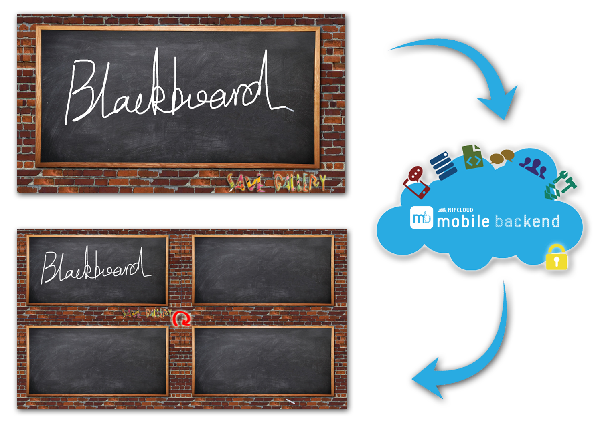
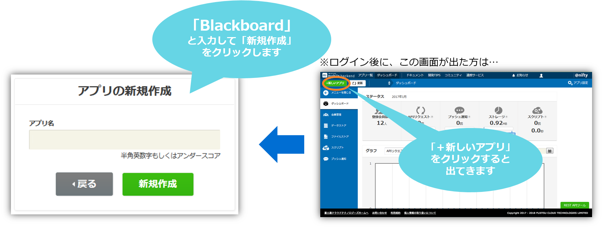
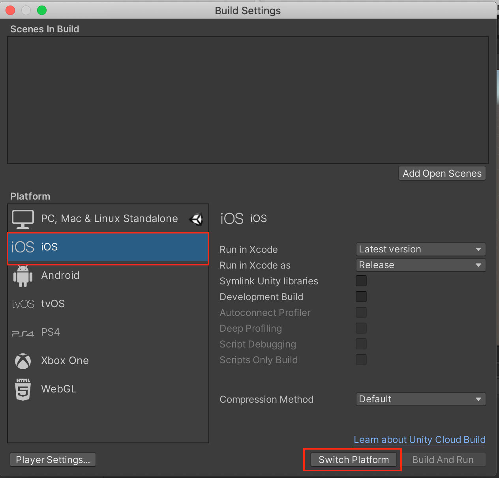
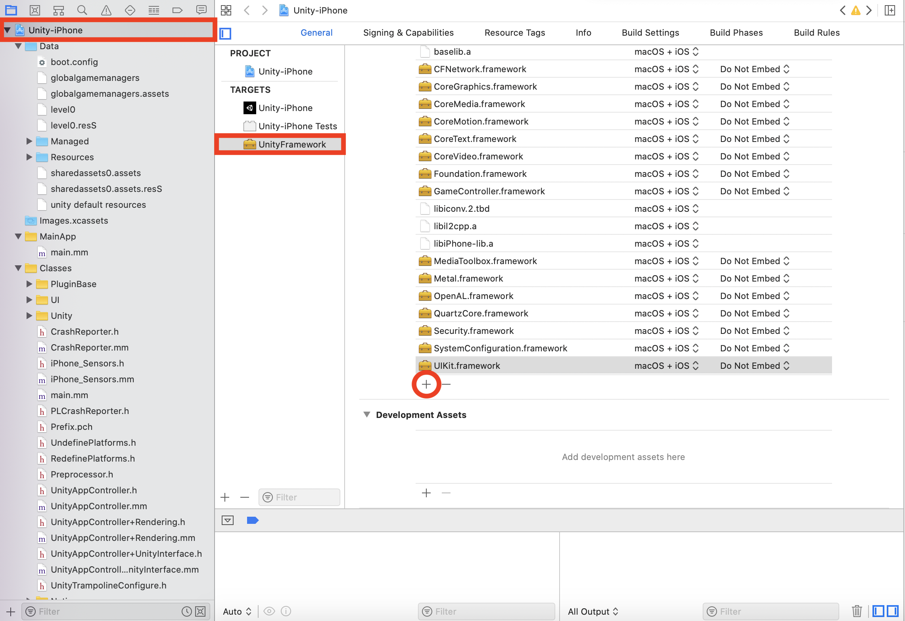
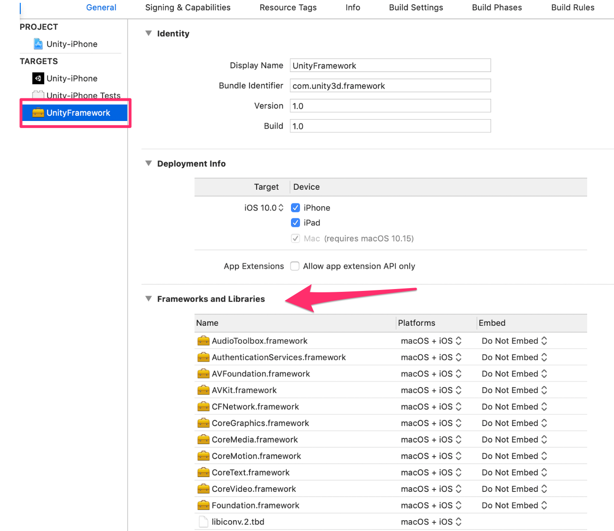
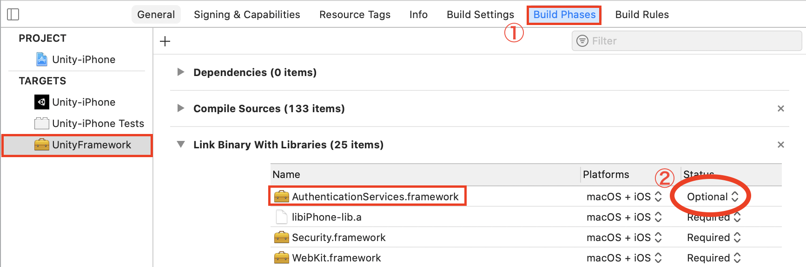
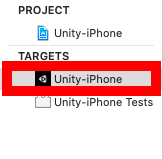
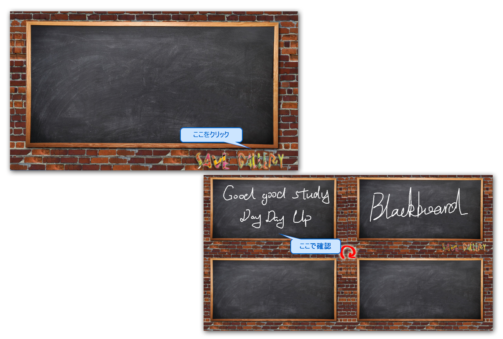
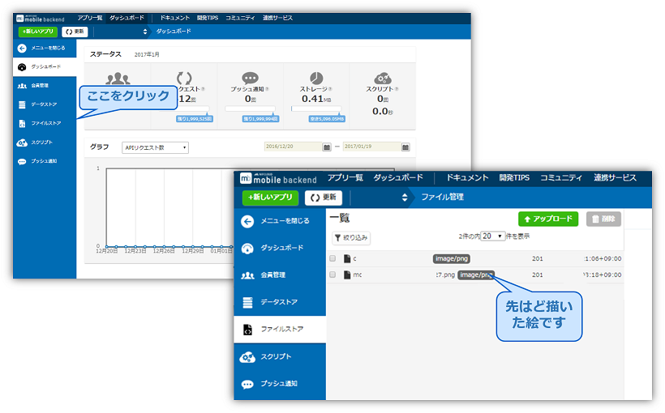
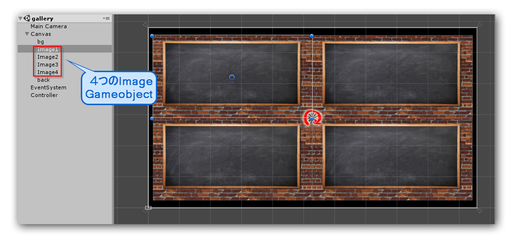

# 【Unity】描いた絵をクラウドで共有しましょう！
### 簡単な絵を描いて、クラウドに保存・取得するのアプリ「Blackboard」


## 概要
* [ニフクラmobile backend](https://mbaas.nifcloud.com/)の『ファイルストア機能』を利用してUnityのサンプルププロジェクトです
* 簡単な操作ですぐに [ニフクラmobile backend](https://mbaas.nifcloud.com/)の機能を体験いただけます★☆

## ニフクラmobile backendって何？？
スマートフォンアプリのバックエンド機能（プッシュ通知・データストア・会員管理・ファイルストア・SNS連携・位置情報検索・スクリプト）が**開発不要**、しかも基本**無料**(注1)で使えるクラウドサービス！今回はデータストアを体験します

注1：詳しくは[こちら](https://mbaas.nifcloud.com/about.htm)をご覧ください


## 動作環境
* MacOS Ventura version 13.4.1
* Android Studio Chipmunk | 2021.2.1 Patch 2
* Pixle 2 - Android 13 (Simulator)
* Xcode 15.0
* Unity 2022.2.19f1 (LTS)
* iPhone SE 17.0.0
* Unity SDK v5.1.1

※上記内容で動作確認をしています。


## 手順
### 『STEP 1』準備＆アプリ起動
### 1. [ニフクラmobile backend](https://mbaas.nifcloud.com/)の会員登録とログイン→アプリ作成

* 上記リンクから会員登録（無料）をします。登録ができたらログインをすると下図のように「アプリの新規作成」画面が出るのでアプリを作成します



* アプリ作成されると下図のような画面になります
* この２種類のAPIキー（アプリケーションキーとクライアントキー）は次のステップで使います。


### 2. GitHubからサンプルプロジェクトの<a href="https://github.com/NIFCLOUD-mbaas/Blackboard/archive/master.zip">ダウンロード</a>

* 上記のリンクをクリックして、プロジェクトをダウンロードして下さい。

### 3. Unityでアプリを起動

* ダウンロードしたフォルダを解凍し、Unityから開いてください。その後、blackboardシーンをダブルクリックして開いてください （シーンに関連オブジェクトが見えない場合は<a href="#ds1">こちら</a>をご覧ください）。


### 4. APIキーの設定

* blackboardシーンの`NCMBSettings`を編集します
* 先程[ニフクラmobile backend](https://mbaas.nifcloud.com/)のダッシュボード上で確認したAPIキーを貼り付けます


* 貼り付けたらシーンを保存して下さい。

##### iOS端末へのビルド

* iOSビルド手順は以下のとおりです。  
iOS端末でビルドを行うには、Unityで.xcodeprojファイルを作成します。
- 「Build Settings」へ戻り、Platformで「iOS」を選択 -> 「Switch Platform」をクリックします。



- ボタンが「Build」に変わったらクリックします。アプリ名を入力するとビルドが開始されるので、完了したらXcodeで開いてください。

- XcodeでPush Notificationの追加とプロビジョニングファイルの設定を行う必要があります。[iOSのドキュメント](https://mbaas.nifcloud.com/doc/current/push/basic_usage_ios.html#Xcodeでの対応)の「5.1 Xcodeでの対応」を実装してください。


###### Xcodeの追加設定

  * iOSであり、Unity SDK v4.0.4以上の場合、Xcode側にて「WebKit.framework」「UserNotifications.framework」を追加する必要があります。
  * Xcodeで「Unity-iPhone」-> General -> TARGETで「UnityFramework」を選択します。追加されているライブラリ一覧の下にある「＋」をクリックします。
  
  * 検索窓にて「Web」と入力し、「WebKit.framework」があるので選択しAddをクリックします。


* 「UserNotifications.framework」ライブラリも同じように検索して追加します


ライブラリ一覧に追加されていることが確認できれば設定完了です。

※注意１: Unity SDK v4.2.0以上を使用している場合、上の２つに加えて「AuthencationServices.framework」も追加する必要があります。



* 「Build Phases」 タブで「AuthenticationServices.framework」を「Optional」にします。  


※注意２： Unity 2019.3未満の場合は、以下の画像のように TARGET->「Unity-iPhone」でフレームワークを追加するようにしてください。
こちらも「WebKit.framework」「UserNotifications.framework」「AuthenticationServices.framework」を追加する必要があります。



- 上記が完了しましたら、iOS動作確認は可能となります。


### 5. アプリ再生
* Unity画面で上部真ん中の実行ボタン（さんかくの再生マーク）をクリックして、次の画面が出たら、成功です！


<br/>

### 『STEP 2』アプリ操作　＆　動作確認
* ブラックボードに適当な絵や文字を描いて、「Save」ボタンをクリックして下さい。

* セーブが完了したら、ブラックボードは初期化されます。「Gallery」をクリックすると、先ほど描いた絵を確認できます。


---------
* ダッシュボードも確認しましょう！
  1. ニフクラmobile backendの<a href="https://console.mbaas.nifcloud.com">ダッシュボード</a>で、左の「ファイルストア」をクリックして下さい。
  2. 先ほど描いた絵の画像ファイルが保存されていることが確認できます。


## 機能解説
### SDKのインポートと初期設定
* ニフクラmobile backend の[ドキュメント（クイックスタート）](https://mbaas.nifcloud.com/doc/current/introduction/quickstart_unity.html)をUnity版に書き換えたドキュメントをご用意していますので、ご活用ください。

### コード解説
プロジェクトのコードファイルは以下の5つになります。これから、`「SaveImage.cs」`と`「LoadImage.cs」`について解説します。
`````````
`````Asset/script
``````````ButtonController.cs     ボタンのclickeventの処理
``````````DrawLine.cs             絵を描く機能の処理
``````````ScreenAdapter.cs        シーン「gallery」に展示する四枚の画像の位置・サイズ調整
``````````SaveImage.cs            描いた絵をスクリーンショットで取得し、クラウドに保存する
``````````LoadImage.cs            クラウドで保存された最新の四枚の画像を取得し、展示する
`````````
### 「SaveImage.cs」
#### 画像を取得し、クラウドに保存
* <a href="https://docs.unity3d.com/ScriptReference/Texture2D.ReadPixels.html">Texture2D.ReadPixels()</a>関数を使って、変数「camera」（シーンのMainCamera）が撮った画面をbyte[]タイプのスクリーンショットで取得する処理：
``````cs
public Camera camera;
RenderTexture renderTexture;

public void saveImage () {
		float width = Screen.width;
		float height = Screen.height;

		renderTexture = new RenderTexture (Screen.width, Screen.height, 0);
		camera.targetTexture = renderTexture;
		camera.Render ();

		RenderTexture.active = renderTexture;
		Texture2D virtualPhoto =
			new Texture2D((int)width, (int)height, TextureFormat.RGB24, false);
		// false, meaning no need for mipmaps
		virtualPhoto.ReadPixels( new Rect(0, 0, width, height), 0, 0);

		RenderTexture.active = null; //can help avoid errors
		camera.targetTexture = null;

		byte[] bytes;
		bytes = virtualPhoto.EncodeToPNG();
		saveToCloud (bytes,getName());
	}
``````

* 取得した画像データをクラウドに保存する処理：
``````cs
	void saveToCloud(byte[] bytes, string name){
		NCMBFile file = new NCMBFile (name, bytes);
		file.SaveAsync ((NCMBException error) => {
			if (error != null) {
				// 失敗
				Debug.Log("upload image error");
			} else {
				//成功
				Debug.Log("upload image success");
				Application.LoadLevel("blackboard");
			}
		});
	}
``````

### 「LoadImage.cs」
#### クラウドから画像を取得し、スクリーンで表示

* シーン「gallery」に4つのImage Gameobjectを用意します。クラウドから取得した画像は、この4つのGameobjectで表示しています。



* 最新画像を1つずつクラウドから取得する処理：<br/>
  - 「imageList」の中身は、シーンから取得した4つのImage Gameobjectです。
``````cs
	public List<Image> imageList;//シーン「gallery」の四つのImage Gameobject

	// Use this for initialization
	void Start () {
		//シーンが開始した時、1つずつ画像を取得する
		for(int i=0; i<imageList.Count; i++){
			LoadOneImage (i, imageList[i]);
		}
	}

	public void LoadOneImage(int index, Image go){
		NCMBQuery<NCMBFile> query = NCMBFile.GetQuery ();
		//検索条件を設定する
		query.Skip = index;
		query.Limit = 1;
		query.OrderByDescending ("createDate");
		query.FindAsync ((List<NCMBFile> objList, NCMBException error) => {
			if (error != null) {
				// 検索失敗
			} else {
				// 検索成功
				foreach (NCMBFile file in objList) {
					file.FetchAsync ((byte[] fileData, NCMBException e) => {
						if (e != null) {
							// 取得失敗
						} else {
							// 取得成功
							SaveBytes(fileData, go);
						}
					});
				}
			}
		});
	}
``````

* 取得した画像をImage Gameobjectで表示する処理：

`````cs
	void SaveBytes(byte[] b, Image go){
		Texture2D texture = new Texture2D (100,100);
		texture.LoadImage (b);
		Sprite sprite = Sprite.Create(texture, new Rect(0, 0, texture.width, texture.height), Vector2.zero);
		go.sprite = sprite;
		Resources.UnloadUnusedAssets();
	}
`````

## トラブルシューティング
<ul><li id="ds1">Unityから開いた後、blackboardシーンに関連オブジェクトが見えない場合<br/>
「Projectビュー」から「blackboard」を ダブルクリックすると、関連オブジェクトがHierarchyビューで見ることができます。
</li></ul>

## 参考
* ニフクラmobile backend の[ドキュメント（ファイルストア）](https://mbaas.nifcloud.com/doc/current/filestore/basic_usage_unity.html)
* このアプリを基にした落書きゲーム[「Doodle」](https://github.com/ellentby/Doodle-DrawTogether)
* このアプリで使用した素材：<br/>
画像　https://www.w3.org/2016/Talks/W3CTrack-IH/
http://www.cutemomentsphotography.com/blackboardadventures.html<br/>
フォント　http://www.11-d.net/11-D35_fonts.htm
